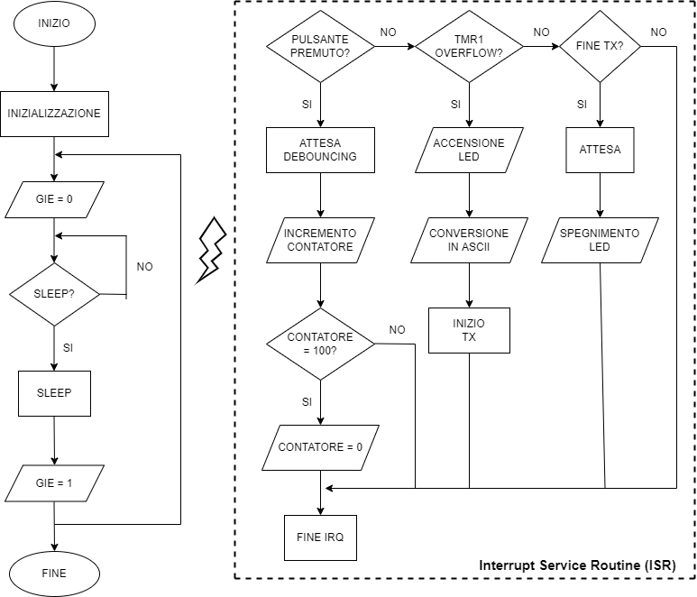

  
# PIC16F887 :minidisc:

### Programmazione in linguaggio Assembly per il corso di Sistemi Elettronici 2021/2022:
  

# Specifiche

* **Hardware:** PIC board - Studio (Microchip PIC16F887 con periferiche)
* **Ambiente di sviluppo:** MPLAB X IDE
* **Linguaggio:** Assembly
* **Gestione eventi:** Microcontrollore in sleep (se possibile) in assenza di eventi da processare

Si realizzi un firmware che conti quante volte un pulsante viene premuto, ed ogni quattro secondi scriva su porta seriale (EUSART) il totale delle pressioni fino a quel momento, sotto forma di numero a due cifre decimali.

# Diagramma di flusso

La figura mostra il diagramma di flusso che è servito da linea guida per la scrittura del codice. L'idea prevede l'utilizzo degli Interrupt affinchè il micro possa andare in modalità sleep quando possibile e le possibili sorgenti sono:

* **RB0/INT:** Interrupt causato dalla pressione del pulsante
* **Timer0:** Interrupt causato dall'overflow di Timer0
* **Timer1:** Interrupt causato dall'overflow di Timer1
* **EUSART:** Interrupt causato dall'inizio della trasmissione su porta seriale

In aggiunta alle specifiche assegnate si è deciso di inserire un **led** che segnala all'utente l'avvio della trasmissione seriale, mentre per rispettare il formato delle due cifre decimali si è scelto di **azzerare** il contatore ogni volta che raggiunge **100**. Così facendo si evita anche l'eventualità in cui il contatore (registro a 8 bit) vada in overflow.

Per una adeguata comprensione si consiglia la lettura dei datasheet forniti.
